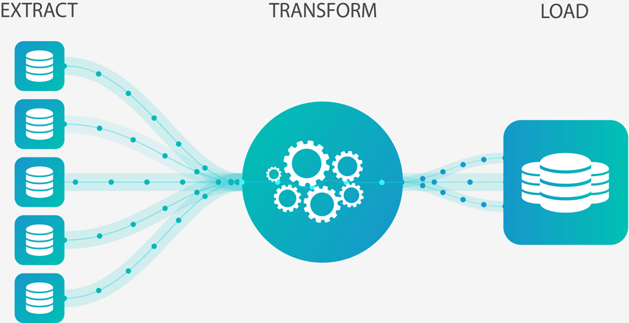

<div align="center" id="top"> 
  

  &#xa0;

</div>

<h1 align="center">ETL Fundamentals</h1>

<p align="center">
  

  

  

</p>


<p align="center">
  <a href="#dart-sobre">Sobre</a> &#xa0; | &#xa0; 
  <a href="#rocket-tecnologias">Tecnologias</a> &#xa0; | &#xa0;
  <a href="#white_check_mark-pré-requesitos">Pré requisitos</a> &#xa0; | &#xa0;
  <a href="#checkered_flag-começando">Começando</a> &#xa0; | &#xa0;
  <a href="https://github.com/isabellazramos" target="_blank">Autor</a>
</p>

<br>

## :dart: Sobre ##

O projeto tem o objetivo de fixar os conhecimentos sobre os fundamentos do processo de ETL (Extração, Transformação e Limpeza) em Python.

A base de dados utilizada trata-se das Ocorrências Aeronáuticas na Aviação Civil Brasileira e foi disponibilizada pelo CENIPA (Centro de Investigação e Prevenção de Acidentes Aeronáuticos) pelo seguinte [link](https://dados.gov.br/dataset/ocorrencias-aeronauticas-da-aviacao-civil-brasileira#).

## :rocket: Tecnologias ##

As seguintes ferramentas foram usadas na construção do projeto:

- Python
- Jupyter Notebook

## :white_check_mark: Pré requisitos ##

Antes de começar :checkered_flag:, você precisa ter o [Git](https://git-scm.com) e o Python instalados em sua máquina.

## :checkered_flag: Começando ##

```bash
# Clone este repositório
$ git clone https://github.com/isabellazramos/etl-data-integration

# Entre na pasta
$ cd ETL-fundamentals

```

Feito com :heart: por <a href="https://github.com/isabellazramos" target="_blank">Isabella M. Ramos</a>

&#xa0;

<a href="#top">Voltar para o topo</a>
